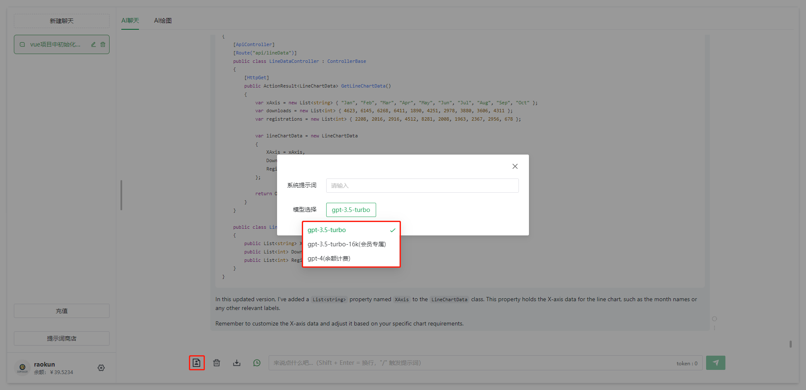

<div align="center">
	<h1>TerraMours Admin</h1>
</div>

[](./LICENSE)  

[中文简介](README.md) | English

## Introduction

[TerraMours Gpt Api](https://github.com/TerraMours/TerraMours_Gpt_Api) is an intelligent assistant project developed and improved based on [TerraMoursFrameWork](https://github.com/TerraMours/TerraMoursFrameWork). The technology includes Net7+MinimalApi+EF Core+Postgresql+Seq+FluentApi...


TerraMours is a practical project that implements user login and features such as multilingual model chat based on SK, multimodal image generation based on chatgpt and SD. The management side includes data dashboards, chat record management, image record management, user management, and system configuration.

Official website: https://terramours.site/


Core features:

1. Refactoring based on Semantic Kernel of https://ai.terramours.site/, realizing multi-AI model chat.
2. Image generation of dallE model of Stable Diffusion and chatgpt.

## Features

1. SignalR+Hangfire to implement background task queues and real-time communication.
2. Automapper for model auto-mapping.
3. Encapsulation of ApiResponse{code, message, data} for uniform return results of interfaces.
4. Semantic Kernel calling chatgpt.
5. Log service Seq.
6. Stable Diffusion image generation.

## Developed Features

- **AI Chat**: Initiate chat based on Semantic Kernel. Currently, chatgpt is written. Common models: gpt-3.5-turbo, gpt-3.5-turbo-16K, gpt-4 are supported.
- **AI Drawing**: Image generation based on dallE model of Stable Diffusion and chatgpt.
- **Chat Records**: Manage chat records and query user session information. (Todo: Create fine-tuning model)
- **Sensitive Word Management**: Manage sensitive words, customize sensitive word filtering, and enhance system security.
- **Key Pool Management**: Manage key pools, support administrators to add multiple keys to form a key pool, and perform polling when calling AI interfaces to enhance system stability.
- **System Prompts**: Add various role prompts to help users better use AI for conversations.


## Update History

2023.12.4 V1.5 NEW!:

1. Refactored backend API services to address concurrent query issues.

2. New additions to the data dashboard functionality:

       1. Sales revenue order statistics table
       2. Token consumption time distribution chart
       3. Online user count time distribution chart
       4. Sales revenue time distribution chart
       5. Statistics and proportional distribution charts of question frequency/image generation frequency/token consumption for each model.

2023.12.4 V1.4 ：
1.Update AllInAI.Sharp.API SDK to version 1.1.6, adding support for retrieving token values from OpenAI's streaming interface.


2023.12.4 V1.3 ：

1. Added support for model  Stable-Diffusion-XL from Wenxin Yiyan。
2. chat and image will all config in key pool configuration。
3. Used the model calling SDK of AllInAI.Sharp.API version 1.15 to uniformly call AI models.

2023.12.4 V1.2:
1. Added support for models such as Wenxin Yiyuan and Tongyi Qianwen.
2. Added  configuration of model key pool for Wenxin Yiyuan and Tongyi Qianwen in the management system.
3. Used the model calling SDK of AllInAI.Sharp.API to uniformly call AI models.

2023.11.16 V1.1.1：
1. Resolve some bugs after updating the key pool

2023.11.15 V1.1:
1. Added support for ChatGLM. Frontend model selection now includes ChatGLM.
2. Refactored the key pool interface. The new key pool allows for specifying a particular model.
3. Fixed an issue where adding a new user with a pricing of 0 still prompted insufficient balance.

## Online Preview

- [TerraMours Admin Preview Address](https://demo.terramours.site/)

## Documentation

- [Project Documentation Address](https://terramours.site/)

## Front-End Services

- [TerraMours_Gpt_Web](https://github.com/TerraMours/TerraMours_Gpt_Web)

## Installation and Usage

- Environment configuration: **.net7 SDK**
- Clone the code:

```bash
git clone https://github.com/TerraMours/TerraMours_Admin_Web.git
```

## Docker Deployment

* Build image:

```bash
docker build -t terramours_gpt_server .
```

* Create a mounting directory (directory is customizable):

```bash
mkdir /data/terramoursgpt/server/images
```

- Deploy terramoursweb using Docker:

```bash
docker run --name terramours_gpt_server -v /data/terramoursgpt/server/images:/app/images  -p 3115:80  -d terramours_gpt_server
```

- Access swagger:

Open the local browser and access `http://localhost/swagger/index.html`

## Quick Setup

### 1. Quick setup of AI chat and drawing system based on docker-compose

#### 1. Create a new empty file named docker-compose.yml

Create a new empty file named docker-compose.yml and paste the following contents into the file, then save it.

```yml
version: "3.9"
services:
  redis:
    image: redis
    container_name: redis_container
    ports:
      - "6379:6379"
    restart: always
    networks:
      - server

  postgres:
    image: postgres
    container_name: postgres_container
    environment:
      - POSTGRES_USER=postgres
      - POSTGRES_PASSWORD=terramours1024
      - POSTGRES_DB=TerraMoursGpt
    ports:
      - "5432:5432"
    restart: always
    networks:
      - server
  server:
    image: raokun88/terramours_gpt_server:latest
    container_name: terramours_gpt_server
    environment:
      - TZ=Asia/Shanghai
      - ENV_DB_CONNECTION=Host=postgres;Port=5432;Userid=postgres;password=terramours1024;Database=TerraMoursGpt;
      - ENV_REDIS_HOST=redis:6379
    volumes:
      # 图片挂载地址，将容器中的图片挂载出来
      - F:\Docker\terra\server\images:/app/images
      # 可挂载自定义的配置文件快速进行系统配置
      #- F:\Docker\terra\server/appsettings.json:/app/appsettings.json
    ports:
      - "3116:80"
    restart: always
    networks:
      - server
    depends_on:
      - postgres
      - redis
  admin:
    image: raokun88/terramours_gpt_admin:latest
    container_name: terramoursgptadmin
    environment:
      - VUE_APP_API_BASE_URL=http://127.0.0.1:3116
    ports:
      - "3226:8081"
    restart: always
    networks:
      - server

  web:
    image: raokun88/terramours_gpt_web:latest
    container_name: terramoursgptweb
    environment:
      - VUE_APP_API_BASE_URL=http://127.0.0.1:3116
    ports:
      - "3216:8081"
    restart: always
    networks:
      - server
    
networks:
  server:
    driver:
      bridge

```

#### 2. Upload the docker-compose file to the server

Upload the docker-compose file to the server using XFTP, the FTP client I am using.

#### 3. Execute Docker command to build the docker-compose

```shell
docker-compose up
```

### 2. Build the front-end project using Docker command

In addition to using docker-compose, we have also uploaded the front-end image to Docker Hub. You can quickly build the front-end project using the Docker command. Execute the following command on the server:

```shell
docker run --name terramoursgptadmin -p 3226:8081 -e VUE_APP_API_BASE_URL=http://127.0.0.1:3116 --restart always -d raokun88/terramours_gpt_admin:latest //Replace VUE_APP_API_BASE_URL with the corresponding backend API address
```

**Note: Replace VUE_APP_API_BASE_URL with the corresponding backend API address**


## Project Screenshots

### User Interface




### Admin Interface


## Open-Source Authors

[@Raokun](https://github.com/raokun)

[@firstsaofan](https://github.com/orgs/TerraMours/people/firstsaofan)

## Communication

`TerraMours Admin` is a completely open-sourced and free-to-use project that helps developers to more conveniently develop medium to large-scale management systems, and also provides WeChat and QQ communication groups. If you have any questions about usage, please feel free to ask in the group.

  <div style="display:flex;">
  	<div style="padding-right:24px;">
  		<p>QQ Communication Group</p>
      
  	</div>
		<div>
			<p>Add me to WeChat for technical exchange and business consultation.</p>
			
		</div>
  </div>

## Donation

If you find this project helpful, you can buy a drink for the TerraMours team to show your support. The motivation for TerraMours to be open-sourced comes from everyone's support and encouragement.

  <div style="display:flex;">
  	<div style="padding-right:24px;">
  		<p>WeChat</p>
      
  	</div>
	  <div style="padding-right:24px;">
  		<p>AliPay</p>
      
  	</div>
  </div>

## License

[Apache License © TerraMours-2023](./LICENSE)
