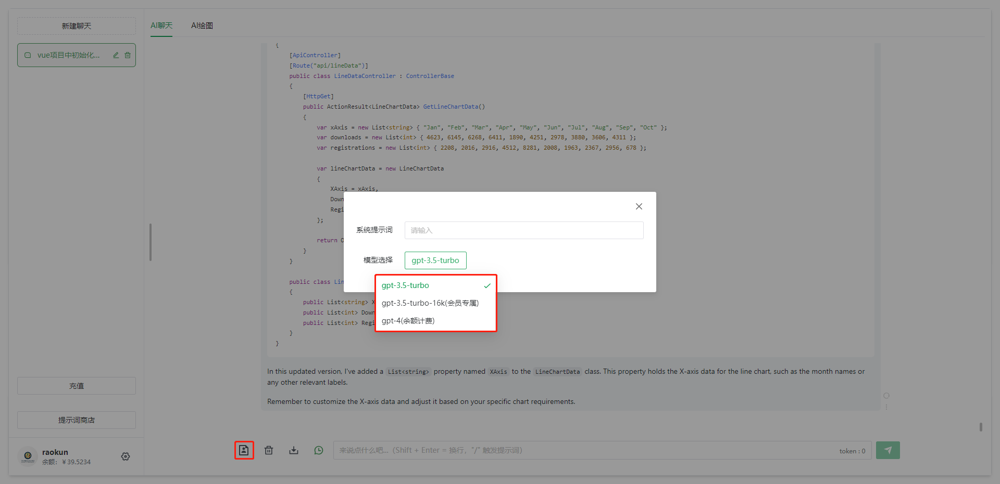

<div align="center">
	<h1>TerraMours Gpt Api</h1>
</div>

 

中文简介 | [English](README-EN.md)

## 简介

[TerraMours Gpt Api](https://github.com/TerraMours/TerraMours_Gpt_Api) 是基于[TerraMoursFrameWork](https://github.com/TerraMours/TerraMoursFrameWork) 开发完善的智能助手项目。技术包括 Net7+MinimalApi+EF Core+Postgresql+Seq+FluentApi ...... 

TerraMours实战项目，实现用户登陆和基于SK的多语言模型聊天、基于chatgpt和SD的多模型图片生成等功能。管理端实现数据看板、聊天记录管理，图片记录管理、用户管理、系统配置等。

官网地址：https://terramours.site/


核心功能：

1.对https://ai.terramours.site/基于Semantic Kernel的重构，实现多AI模型的聊天

2.Stable Diffusion和chatgpt的dallE模型的图片生成

## 特性

##### 1.SignalR+Hangfire 实现后台任务队列和实时通讯

##### 2.automapper 模型自动映射

##### 3.对接口统一返回结果中间件ApiResponse{code,message,data}封装

##### 4.Semantic Kernel 调用chatgpt

##### 5.日志服务Seq

##### 6.Stable Diffusion 图片生成

## 开发功能
- **AI聊天**：发起聊天，基于Semantic Kernel，目前写了chatgpt，常用模型：gpt-3.5-turbo，可支持gpt-3.5-turbo-16K,gpt-4
- **AI绘图**：基于Stable Diffusion和chatgpt的dallE模型的图片生成
- **聊天记录**：聊天记录管理，查询使用者会话信息。（todo：创建微调模型）
- **敏感词管理**: 敏感词管理，自定义敏感词过滤，加强系统安全
- **Key池管理**：Key池管理，支持管理者添加多个key组成Key池，调用ai接口时轮询，加强稳定性
- **系统提示词**：系统提示词，添加各种角色提示词，让使用者能更好的使用ai对话。


## 更新记录

2023.12.15 V1.5 NEW!：
1.重构后台API服务，解决查询并发问题

2.数据看板功能新增项：

       1. 销售额订单统计表
       2. token 消耗量时间分布统计图
       3. 上线人数时间分布统计图
       4. 销售额时间分布统计图
       5. 各模型的提问次数/图片生成次数/token消耗量 统计数量和比例分布图

2023.12.4 V1.4 ：
1.更新AllInAI.Sharp.API sdk到1.1.6版本，支持了openai的流式接口的token值获取

2023.12.4 V1.3：
1.增加对文心一言的Stable-Diffusion-XL模型支持。
2.聊天和画图调用的模型配置统一到key池配置。
3.使用AllInAI.Sharp.API 的模型调用SDK version 1.15，统一调用AI模型。

2023.12.4 V1.2 ：
1.增加对文心一言、通义千问的模型支持。
2.管理系统添加文心一言、通义千问的模型key池配置。
3.使用AllInAI.Sharp.API 的模型调用SDK，统一调用AI模型。

2023.11.16 V1.1.1：
1.解决更新key池后的部分bug

2023.11.15 V1.1：
1.新增对 ChatGLM 的支持，前端模型选择添加 ChatGLM
2.重构key池接口。新key池可设置指定模型
3.修复 定价为0时，新增用户仍会提示余额不足的问题。


## 在线预览

- [TerraMours Admin 预览地址](https://demo.terramours.site/)

## 文档

- [项目文档地址](https://terramours.site/)


## 前端服务

- [TerraMours_Gpt_Web](https://github.com/TerraMours/TerraMours_Gpt_Web)


## 安装使用

- 环境配置
  **.net7 SDK**

- 克隆代码

```bash
git clone https://github.com/TerraMours/TerraMours_Admin_Web.git
```


## Docker 部署

* 构建镜像

```bash
docker build -t terramours_gpt_server .
```

* 创建挂载目录（目录自定义）

```bash
mkdir /data/terramoursgpt/server/images
```

- Docker 部署 terramoursweb

```bash
docker run --name terramours_gpt_server -v /data/terramoursgpt/server/images:/app/images  -p 3115:80  -d terramours_gpt_server
```

- 访问 swagger

打开本地浏览器访问`http://localhost/swagger/index.html`


## 快速搭建

### 1.基于dockercompose的快速搭建AI聊天和画图系统

#### 1.新建一个空文件命名为docker-compose.yml

新建一个空文件命名为docker-compose.yml，将以下内容粘贴到文件中保存

```yaml
version: "3.9"
services:
  redis:
    image: redis
    container_name: redis_container
    ports:
      - "6379:6379"
    restart: always
    networks:
      - server

  postgres:
    image: postgres
    container_name: postgres_container
    environment:
      - POSTGRES_USER=postgres
      - POSTGRES_PASSWORD=terramours1024
      - POSTGRES_DB=TerraMoursGpt
    ports:
      - "5432:5432"
    restart: always
    networks:
      - server

  seq:
    image: datalust/seq
    container_name: seq_container
    environment:
      - ACCEPT_EULA=Y
    ports:
      - "5341:80"
    restart: always
    networks:
      - server

  server:
    image: raokun88/terramours_gpt_server:latest
    container_name: terramours_gpt_server
    environment:
      - TZ=Asia/Shanghai
      - ENV_DB_CONNECTION=Host=postgres;Port=5432;Userid=postgres;password=terramours1024;Database=TerraMoursGpt;
      - ENV_REDIS_HOST=redis:6379
      - ENV_SEQ_HOST=http://<YOUR-SERVER-IP>:5341/
    volumes:
      # 图片挂载地址，将容器中的图片挂载出来
      - /path/terra/images:/app/images
      # 可挂载自定义的配置文件快速进行系统配置
      #- F:\Docker\terra\server/appsettings.json:/app/appsettings.json
    ports:
      - "3116:80"
    restart: always
    networks:
      - server
    depends_on:
      - postgres
      - redis
  admin:
    image: raokun88/terramours_gpt_admin:latest
    container_name: terramoursgptadmin
    environment:
      - VUE_APP_API_BASE_URL=http://<YOUR-SERVER-IP>:3116
    ports:
      - "3226:8081"
    restart: always
    networks:
      - server

  web:
    image: raokun88/terramours_gpt_web:latest
    container_name: terramoursgptweb
    environment:
      - VUE_APP_API_BASE_URL=http://<YOUR-SERVER-IP>:3116
    ports:
      - "3216:8081"
    restart: always
    networks:
      - server

networks:
  server:
    driver:
      bridge

```

##### 安装注意

1.修改yml：将`<YOUR-SERVER-IP>` 替换成服务器IP<br/>
2.默认管理员账号密码：terramours@163.com  terramours@163.com<br/>
3.系统报错，通过seq查看，查看地址：`http://<YOUR-SERVER-IP>:5341/`<br/>
4.seq日志中显示`初始化数据库成功` 即代表后端服务初始化成功，首次安装可能会有报错的现象，建议dockercompose安装完成后重启terramours_gpt_server容器<br/>
5.更多服务配置，可以把服务端的github上的appsettings.json文件拷到服务端，通过挂载修改容器中的配置文件<br/>
```
# 可挂载自定义的配置文件快速进行系统配置
- /path/terra/appsettings.json:/app/appsettings.json
```


#### 2.上传dockercompose文件到服务器

上传dockercompose文件到服务器，我使用的是XFTP。

#### 3.执行docker命令，构建dockercompose

```shell
docker-compose up
```

## 项目截图

### 用户端




### 管理端


## 开源作者

[@Raokun](https://github.com/raokun)

[@firstsaofan](https://github.com/orgs/TerraMours/people/firstsaofan)


## 交流

`TerraMours Admin` 是完全开源免费的项目，在帮助开发者更方便地进行中大型管理系统开发，同时也提供微信和 QQ 交流群，使用问题欢迎在群内提问。

  <div style="display:flex;">
  	<div style="padding-right:24px;">
  		<p>QQ交流群</p>
      
  	</div>
		<div>
			<p>添加本人微信，欢迎来技术交流，业务咨询</p>
			
		</div>
  </div>

## 捐赠

如果你觉得这个项目对你有帮助，可以请 TerraMours 组员喝杯咖啡表示支持，TerraMours 开源的动力离不开各位的支持和鼓励。

  <div style="display:flex;">
  	<div style="padding-right:24px;">
  		<p>微信</p>
      
  	</div>
	<div style="padding-right:24px;">
  		<p>支付宝</p>
      
  	</div>
  </div>

## License

[Apache License © TerraMours-2023](./LICENSE)
